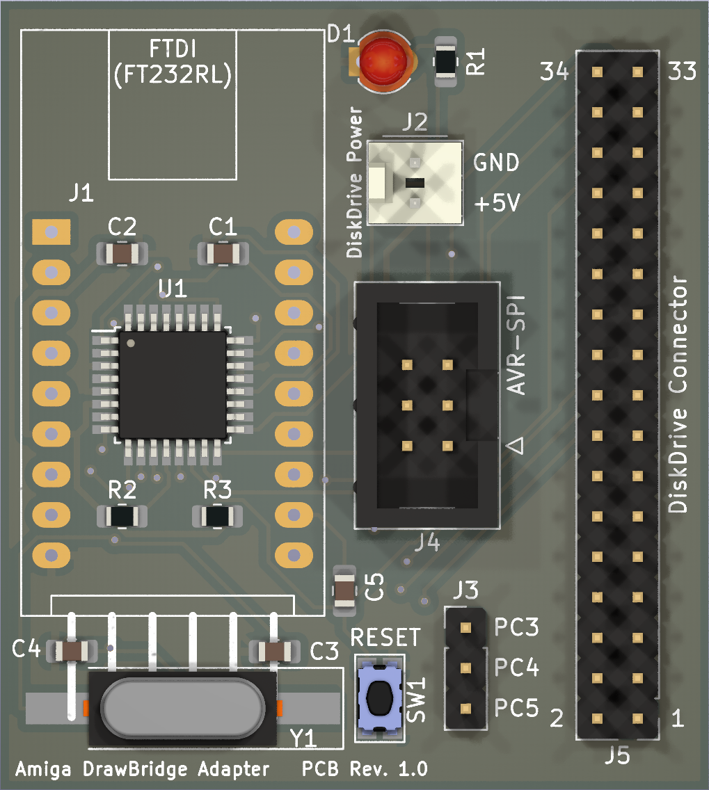
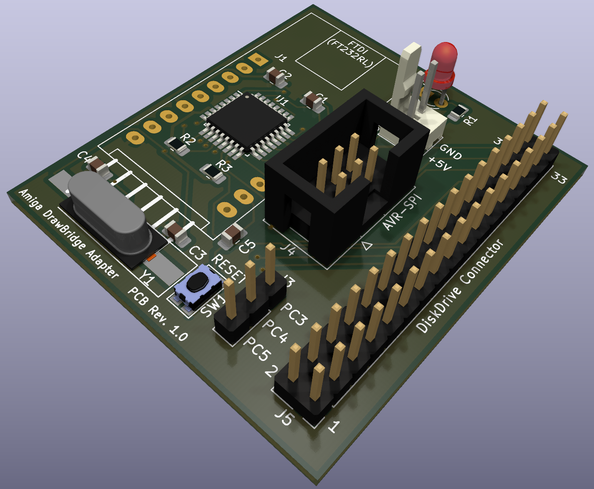

# Amiga DrawBridge Adapter
Here is an adapter for the amiga drawbridge project. Thanks Rob Smith (https://github.com/RobSmithDev/ArduinoFloppyDiskReader) This Adapter include the Atmega328P microcontroller. The adapter can programming over ISP or USB Serial. The bootloader must first flashing on the Atmega328p over the ISP interface.

## The circuit board has not yet been tested!

